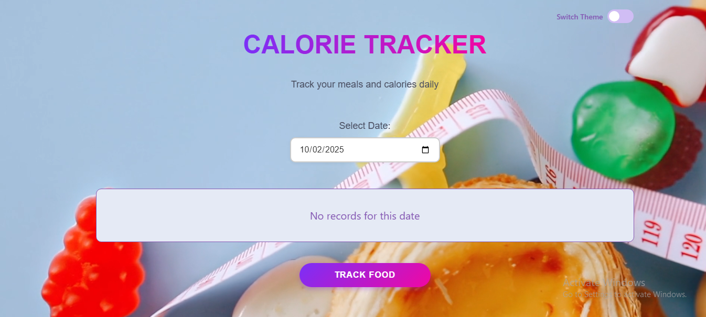
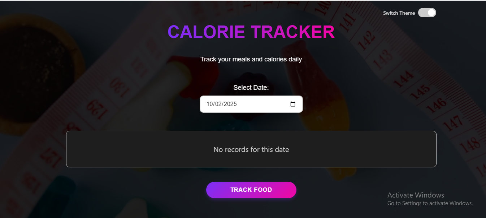

<h1 align="center">🍽️ Calorie Tracker</h1>

A simple and responsive <strong>Calorie Tracker</strong> built with <strong>React (JSX & Components)</strong>, 
<strong>CSS Modules</strong>, and <strong>JavaScript</strong>.  
It helps users log daily meals, track calories, and manage their records with persistence using <em>localStorage</em>.  
Designed with smooth UI, theme toggle, and small animations for a modern experience ✨

<h2>📸 Preview</h2>

  
   
  

<h2>🚀 Features</h2>
<ul>
  <li>📅 Add daily records (meal, content, calories, date)</li>
  <li>🗑️ Delete records with confirmation</li>
  <li>💾 Data persistence using <strong>localStorage</strong></li>
  <li>🌙 Dark / Light mode toggle</li>
  <li>🎬 Background video & splash screen animation</li>
  <li>✅ Success notification (record added)</li>
  <li>📱 Fully responsive design for desktop & mobile</li>
  <li>🎨 Clean UI with hover effects and purple theme</li>
</ul>

<h2>🛠️ Tech Stack</h2>
<ul>
  <li>⚛️ <strong>React</strong> (functional components + hooks)</li>
  <li>📄 <strong>JSX</strong> (UI written as declarative JavaScript)</li>
  <li>🎨 <strong>CSS Modules</strong> (scoped styling)</li>
  <li>💾 <strong>LocalStorage</strong> (persistent records)</li>
  <li>✨ <strong>JavaScript ES6+</strong> (array methods, state handling)</li>
  <li>🎬 Small animations (hover effects, splash screen, transitions)</li>
</ul>

<h2>🧠 What I Practiced</h2>
<ul>
  <li>Breaking down UI into reusable React components</li>
  <li>Managing state with <code>useState</code> and persisting with localStorage</li>
  <li>Working with forms, validation, and controlled inputs</li>
  <li>Applying CSS Modules for modular and clean styling</li>
  <li>Creating light/dark theme toggle for better UX</li>
  <li>Adding small animations and hover states for better UI feel</li>
</ul>

<h2>🧪 How to Run</h2>
<ol>
  <li>📥 Clone or download this repository</li>
  <li>📂 Open terminal and navigate to the project folder</li>
  <li>⚡ Run <code>npm install</code> to install dependencies</li>
  <li>🚀 Run <code>npm run dev</code> to start development server</li>
  <li>✅ Open in browser and start adding your records</li>
</ol>

<h2>💬 Contact</h2>

📧 Email: <a href="mailto:yousseftalaat142@gmail.com">yousseftalaat142@gmail.com</a>

🔗 LinkedIn: <a href="https://www.linkedin.com/in/youssef-talaat-1aa2671b3/">Youssef Talaat</a>

---

<h3 align="center">✨ Created & Maintained by <strong>Youssef Talaat</strong></h3>
